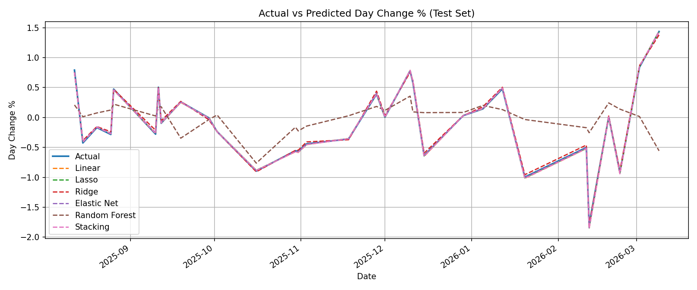

# Opening Hour Financial Movement Using Kalshi Federal Funds Rate Predictions

## Project Overview
This project seeks to predict how the financial markets move during the opening hour based on Kalshi's Federal Funds Rate Prediction Market using Kalshi's API along with S&P 500 Overnight futures trading activity and other macroeconomic indicates such as treasury yields, VIX (volatility index for all stocks traded), and the federal funds rate. The movement measures the difference between the previous trading day's closing price and the current trading day's opening price.

Kalshi allows users to place bets predicting the Fed's Federal Funds rate decision, which we propose to use as a signal for people's expectations of the economy. Leveraging the fact that Kalshi allows users to trade overnight, we test whether different changes in this signal during market closure can be used to better predict the change in the S&P500 from its previous closing price to its opening price. Our results indicate that the features from Kalshi enchance our predictions, and highlight the strengths and limitations of different models in our prediction exercise.

## Data
### Data Sources
Train/Forecast window: 07/30/2025 - 03/10/2026
The S&P 500 opening and closing price data is collected from Yahoo's S&P 500 Data via the yfinance python library. S&P500 overnight futures are also collected through the yfinance python library.
3 month, 2 year, and 10 year treasury yields are collected from the [FRED's API](https://fred.stlouisfed.org/docs/api/api_key.html) along with the yield curve, VIX, and the federal funds rate for a given day. 
*Brad*
The Federal Funds Rate Prediction Market is collected from [Kalshi's API](https://docs.kalshi.com/welcome) using the series ticker "KXFEDDECISION"
*Marco*
The data set values range from July 30th 2025 to March 10th 2026.
### Data Collection and Cleaning
The project uses a Jupiter Notebook called the [SP500_notebook](SP500_notebook.ipynb) to sort through the Yahoo S&P 500 data and collect the intraday differences between the previous trading day's closing price and the current trading day's opening price. SP500 data is pulled from the yahoo finance api in a daily, wide dataframe with multiple indexes. The dataframe indexes are collapsed to be indexed only on date, day change %, and lag variables are added to the data frame. The S&P 500 data is exported into a csv file under [SP500_data](SP500_data.csv). 

The project also uses anoter Jupiter Notebook called the [SP500futures_otebook](SP500futures_notebook.ipynb) to sort through the Yahoo S&P 500 futures data for overnight trading. The notebook collects the trading price hourly starting from market close from 6:00pm EST to thirty minutes before market open at 9:00am EST. The data then creates an overnight return variable, an overnight volatility variable, and collects the last observed hourly price at 9:00am EST to be stored in a csv file. The S&P 500 overnight futures data is exported into a csv file under [Overnight_SP500_data](Overnight_SP500_data.csv). 

The python file called [fred_data_download](fred_data_download.py) collects the 3 month, 2 year, and 10 year treasury yields, the yield curve, VIX, and the federal funds rate for the given period. The file pulls the data into a single dataframe used to parquet for pipeline.

#### Kalshi data

In pull_kalshi_api, we pull the kalshi data from their api at the hourly "ticker" level. The ticker here is a "yes/no" betting line for what the fed will decide at a given meeting. 

The data starts at July 30 2025 and extends to the present, and we pull it in "candlestick" format, meaning we get for each hour and ticker combination:
	- Volume traded in the hour
	- Open interest (volume traded for the ticker throughout all time)
	- Mean bet price
	- Low bet price
	- High bet price

We then pull the list of tickers kalshi offers for the "fed decision" market to get the open and close dates and times of each ticker and filter to only include the tickers for the upcoming fed meeting (Kalshi offers you the ability to bet on future fed meetings as well).We then characterize each ticker-hour by whether markets are open and if they are on weekends.

To quantify what the prediction markets are telling us, we calculate an "expected change of fed rate", being the average of the predictions  of what will happen to the fed rate weighted by volume. 

$$ \Delta expectedrate = \frac{-0.25 * volume_{cut} + 0 * volume_{stay} +0.25 * volume_{hike}}{\sum volume_i}$$

For convenience, we ignore the tickers for hikes or cuts above 25 basis points, but these tickers are traded much less frequently. 

We then aggrergate the data across the market asleep time into the next trading day. (From 5pm 7/30 et- 9 am 7/31 et will be characterized as 7/31), and take
	- The sum of total volume across the market asleep period for each ticker
	- The % change across the market asleep period of:
		- Mean price for each ticker
		- The expected fed rate (volume and open interest)
		
And join it with our macro indicator data to get the final dataset to train and test our model. 

All time data will be displayed in Eastern Time (EST) for consistency with operating market hours.
### Data Limitations
Time frame provided by FRED is limited (only a little more than 7 months). The past 7 months have experienced considerable volatility given an increased prevalence of policy shocks.

## Methodology
We evaluate several machine learning models to predict daily S&P 500 market movements with a combination of financial market data, macroeconomic indicators, and prediction market signals from Kalshi. Our target variable here is the daily market movement which is measured by Day Change % that represents the percent change between the previous trading days close and the current trading days open. The predictive prefromance is assesed through multiple regression based approaches that are implemented and the coomparing out-of-sample metrics. 

Baseline Model: Linear Regression 

A standard linear regression model is used as the baseline benchmark. This provides a useful reference point for us to determine what other techniques could be used to improve the predictive preformance. However, we expect this model to have limitations here becasue of how many predictors in the dataset are correlated. 

Regularized Linear Models: 

Going into this we know that many of the financial and macroeconomic variables are heavily correlated, regularization methods were implemented to help stabilize coefficient estimates and reduce overfitting.
* Lasso Regression: Performs variable selection by shrinking some coefficients to zero, which should be effective when there are many predictors.
* Ridge Regression: Shrinks coefficients but keeps all the predictors, should be effective when predictors are highly correlated. 
* Elastic Net: Combines both the lasso and ridge regression to allow the model to preform both coefficient shrinking and variable selection simultaneously.  

Because we had a smaller dataset we utilized the cross-validated versions (`LassoCV`, `RidgeCV`, and `ElasticNetCV`) to help ensure the models generalize well and avoid overfitting the data. This helps prevent overfitting and produces more stable parameter estimates without manual tuning. 

Nonlinear Model: Random Forest

A random forest model was included to help capture  nonlinear relationships and any potential interactions among the predictors. For example we could potentially see interactions between volatility measures, interest rates, and overnight futures that may influence market movements in ways that are not purely linear. 

Ensemble Model: Stacking

A stacking model was implemented with `StackingRegressor` to combine predictions from the lasso model and the random forest model to look at a model that combines capturing both the linear relationships and preforms variable selection with capturing the nonlinear relationships and interactions. 

All models were evaluated with a chronological train/est split to help mimic an out-of-sample forecasting scenario. Preformance was measured using the mean squared error and the root mean squared error on both the training and the test dataset, which allowed us to evaluate the predictive accuracy and see if there is any potential overfitting. 

## Results
The train and test MSE values from the five models are reproduced below:
| Model | Train MSE | Test MSE |
| :--- | :--- | :--- |
| Linear Regression | 0.0002363762177756273 | 0.0003169875288916838 |
| Lasso | 0.0002563307767950481 | 0.0002463168461297715 |
| Ridge | 0.0010176078034475062 | 0.0010134060445877683 |
| Elastic Net | 0.0002755623454545451 | 0.00025072575196162235 |
| Random Forest | 0.06431674622296985 | 0.40042649247406187 |
| Stacking Regressor  | 0.000248 | 0.000290 |

The linear regression model has very close train and test MSEs, signaling that the model generalizes well as a baseline model. However, given many of the variables are very closely related, such as opening S&P 500 price and overnight future price at 9:00am EST, these MSEs may signal that there is high autocorrelation in the model. Financial market variables that are measured within minutes of each other often move together, meaning that ordinary least squares may suffer from multicollinearity even though the model appears to fit the data well.

The LASSO model also has very close train and test MSEs like the linear regression but with the test MSE being slightly lower than the the train MSE. The LASSO model performs better than the linear regression model because it drops the S&P 500 high and low, the federal funds rate, the 3month and 10 year treasury yields, and the volume of betting betting no change in the federal funds rate. This shrinks the less informative coefficients to zero, given many of the predictors have overlapping information on predicting monetary policy. Since the LASSO model uses only the most predictive variable, the LASSO reduces the most noise and produces the lowest MSEs overall between the models.

The Ridge regression model produces larger train and test MSE values than the other linear models. Ridge uses a penalty that shrinks coefficients toward zero but it does not eliminate them entirely. Since all of the variables are in the model, correlated predictors such as S&P 500 futures prices and recent index returns continue to introduce redundancy into the regression. Therefore, the Ridge model may over-penalize the coefficients while still keeping noisy predictors in the model. This leads to weaker predictive accuracy compared to the LASSO and Elastic Net models.

The Elastic Net model, which combines both types of penalties from the LASSO and Ridge regression, performs closely to the LASSO model. This resulted in the second-lowest test MSE. Given that many predictors are correlated but still contain incremental information about overnight market expectations, Elastic Net is able to stabilize the regression while still removing some redundant variables and noise. The Elastic Net model's MSEs  suggests that a hybrid approach is works well when predicing financial  problems where predictors are highly correlated.

The Random Forest model performs worse than all of the linear models given the larger train and test MSE values. The large gap between the train and test errors indicates significant overfitting. Random Forest models are powerful for capturing nonlinear relationships, but the dataset consists of financial variables that are largely linear transformations of each other. Additionaly, the small sample size of daily market observations limits the ability of tree-based models to learn stable patterns.

Below displays the predicted values of all 5 models against the opening S&P 500 price.

As we can see, all models predict the opening price very closely except for the Random Forest, which makes sense given the Random Forest model had significantly worse MSE values compared to the other model's very small MSE values.

We find that the Kalshi data generally augments the predictive power of our model, as highlighted by the fact that the only feature dropped by the LASSO and Elastic Net models are the volume traded in the "Fed mantains rates" ticker. More specifically, we find that our percentage change in expected change in Federal Funds rate, percentage change in average price across all tickers, and volume traded in "Fed cuts rates 25 bps" and "Fed hikes rates by 25 bps" provide predictive power to our models.

Model Coefficients 
| Feature | Lasso Coef | Ridge Coef | Elastic Net Coef |
|--------|-----------|-----------|------------------|
| Close | 2.7956 | 2.6772 | 2.7884 |
| Open | -2.7583 | -2.5306 | -2.7230 |
| Futures_Last_Price | -0.0063 | -0.1795 | -0.0378 |
| 2yr_treasury | -0.0029 | -0.0239 | -0.0039 |
| volume_H25 | 0.0013 | 0.0015 | 0.0018 |
| yield_curve | 0.0006 | -0.0107 | 0.0008 |
| VIX | -0.0005 | -0.0148 | -0.0018 |
| Overnight_Return | -0.0004 | -0.0049 | -0.0010 |
| volume_C25 | -0.0004 | -0.0001 | -0.0013 |
| mean_H0 | 0.0003 | 0.0027 | 0.0011 |
| exp_rate | 0.0002 | 0.0047 | 0.0011 |
| Overnight_Volatility | 0.0002 | 0.0002 | 0.0005 |
| Volume | -0.0000 | 0.0047 | -0.0000 |
| Low | 0.0000 | 0.0670 | 0.0034 |
| High | 0.0000 | -0.0151 | 0.0002 |
| fed_funds_rate | 0.0000 | -0.0371 | 0.0000 |
| 10yr_treasury | 0.0000 | 0.0070 | 0.0000 |
| 3m_treasury | 0.0000 | 0.0291 | 0.0011 |
| volume_H0 | 0.0000 | 0.0012 | 0.0000 |
### Recommendations
Overall, the results suggest that the Kalshi data is useful and regularized linear models like the standard Linear Regression, LASSO, and Elastic Net perform the best for predicting the S&P 500 opening price for this project. Among the models tested, the LASSO regression provides the strongest out-of-sample performance. This indicates that variable selection plays the most important role when working with highly correlated financial indicators. The Elastic Net performed the second best given its hybrid nature between LASSO and Ridge models. The Random Forest is not recommended for this study given the non-linear nature of the model and the linear nature of the financial variables.

## Limitations
The main limitation for the models was the sample size. With only 7 months of data, the predictive power that was possible through the models was somewhat limited by only possessing data for a period where the main expectations was rate cuts. Our Random Forest model was especially limited by the small sample size. Additionally, data about the exact numbers of bets for and against particalur federal funds rate outcomes would have provided very helpful information. There is also some concern about potentially high multicollinearity between several of the variables used. 

## Reproduction
1. Clone the repository `git@github.com:bradleyvance23/eco395-ml-midterm-kalshi.git`
2. Install additional packages `pip install -r requirements`
3. Run 

